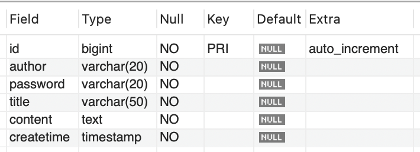
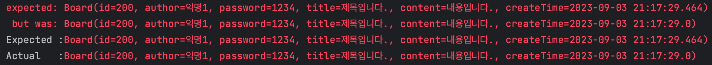

## Database Test
### Mocking vs Test DB

---

**서론:**  
DB를 테스트하는 방법은 크게 `Mocking`, `TestDB`가 있습니다.  
`Mocking`은 **실제 DB에 연결하지 않고** DB역할을 하는 가짜 객체에게 요청과 응답을 테스트하는 방법입니다.  
`TestDB` 는 **실제 DB에 연결하고**, 테스트용 데이터베이스와 실제 상호작용하며 테스트하는 방법입니다.

어떤 방법으로 DB를 테스트하는게 좋을지가 이 글의 주제입니다.

<br> </br>

**본론:**  
TestDB의 가장 큰 장점은 **DB에 실제로 연결하고, 테스트 데이터를 실제로 넣어보며 상호작용**한다는 것입니다. 이는 **애플리케이션 환경과 DB서버 환경이 다름에서 발생하는 여러가지 이슈들을 테스트**할 수 있습니다.
개인 프로젝트를 진행하며 트러블 슈팅한 사례를 예시로 설명드리고자 합니다.  


- Java의 Board 도메인 객체와 MySQL Board 테이블의 명세는 다음과 같습니다.
```java
public class Board {
    private Long id;
    private String author;
    private String password;
    private String title;
    private String content;
    private Timestamp createTime;
   	
    // something
}
```



  
  
- 테스트 코드와 테스트 결과는 아래와 같고, 테스트 디비에 직접 테스트하였습니다.
```java
@Test
@DisplayName("게시판 조회")
void read() {
    // given
    testBoard = new Board("익명1", "1234", "제목입니다.", "내용입니다.", new Timestamp(System.currentTimeMillis()));
    Board saveBoard = repository.save(testBoard);

    Board findBoard = repository.findById(saveBoard.getId());
    assertThat(findBoard).isEqualTo(saveBoard);
}
```



**원인:** 애플리케이션 환경과 DB서버 환경의 설정 불일치  
- 공식문서를 통해, 문제의 원인을 파악할 수 있었는데요. 테이블 Timestamp 컬럼과 Java Timestamp의 **나노초 소수점 처리방식을 일치시키지 않았기 때문**입니다.
- Java 에서 제공하는 Timestamp 데이터 타입과 MySQL의 Timestamp 컬럼 타입 모두 ms를 지원해줍니다.
- Java는 소수점 자리 처리방식이 default = 2번째 자리입니다.
- MySQL은 소수점 자리 처리방식이 default = 0번째 자리입니다.

따라서, 테이블을 생성할 때 아래와 같이 명시해주어야 합니다.
이외에, LocalDateTime 등 **나노초를 지원하는 모든 라이브러리도 동일**합니다.

```
CREATE TABLE fractest( c1 TIMESTAMP(2) );
INSERT INTO fractest VALUES
('2018-09-08 17:51:04.777');
```

```
mysql> SELECT * FROM fractest;
+------------------------+
| c1                     |
+------------------------+
| 2018-09-08 17:51:04.78 |
+------------------------+
```

해당 crud프로젝트는 나노초 단위는 필요하지 않아서, 소수점을 처리하지 않는 방식으로 명세를 통일하여 해결했습니다.
애플리케이션 요구사항에 따라 나노초 필요 여부를 판단하고 일치시키면 될 것입니다.


<br> </br>

**결론:**  
Mock의 경우 애플리케이션 환경과 실제 DB 환경이 다른 경우 발생하는 이슈들에 대한 테스트가 이루어지지 않을 수 있습니다. 따라서,
실제 DB와 테스트를 진행하는 것이 좋을 것으로 생각합니다.