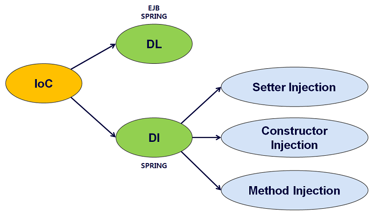

# IoC/DI, AOP, PSA는 무엇일까?

**_IoC/DI, AOP, PSA는 스프링 프레임워크의 3대 핵심 개념이다._**

스프링은 IoC/DI 를 통해 객체 간의 의존 관계를 설정하고,  
AOP 를 통해 핵심 관점과 부가 로직을 분리해 개발하며,  
PSA 를 통해 추상화된 다양한 서비스들을 일관된 방식으로 사용하도록 한다.

3대 핵심 개념을 구현함으로써 스프링 프레임워크의 목적인 POJO 프로그래밍을 달성할 수 있다.  
따라서 굉장히 중요한 개념이며, 본문에서 각각의 개념적인 지식을 알아보고 추후 코드 레벨에서 이해하는 방식으로 진행해 보고자 한다.

우선 복습으로 POJO의 장점 3가지를 알아보고 넘어가자.

```
- 특정 기술에 종속적이지 않고, 재사용 가능, 유연한 확장
- 코드가 간결해짐, 디버깅 쉬워짐, 테스트 단순해짐
- 객체지향적인 설계를 제한없이 적용할 수 있다.
```

## IoC/DI / Dependency Injection

### IoC (Inversion of Control)

**_제어의 역전_**  
애플리케이션 흐름의 주도권을 Spring이 갖는다 라는 것이다.  
**_이는 애플리케이션 안에서 객체가 생성/해제 및 참조하는 작업을 전적으로 프레임워크가 관리하는 형태를 말한다._**

**_프레임워크_** 와 **_라이브러리_** 는 개발자에게 필요한 기능을 제공한다는 점은 동일하지만,  
라이브러리는 개발자가 애플리케이션의 흐름을 주도하고, 프레임워크는 애플리케이션이 애플리케이션의 흐름을 주도하는 것으로.  
이런 식으로 주도권이 뒤바뀐 것을 IoC 라고 한다.

스프링 프레임워크는 **_객체의 생명주기_** 및 **_타 객체와의 의존관계설정_** 을 객체 자신이 아닌 IoC 컨테이너(어플리케이션 컨텍스트, 빈 팩토리 등으로 표현) 가 해주기 때문에 IoC 프레임워크라고 할 수 있다.



---

### Reference

[[Spring] - IOC/DI, AOP, PSA란?](https://devloper-dreaming.tistory.com/147)
