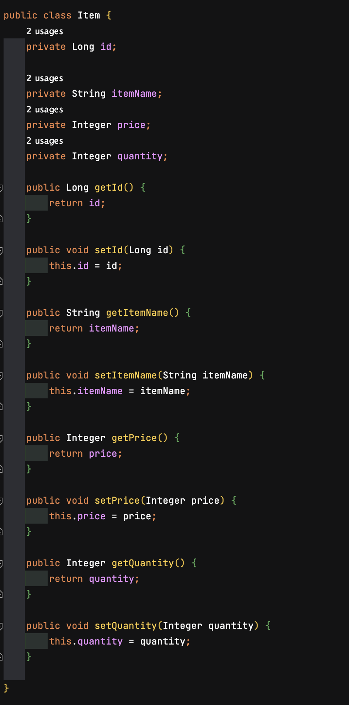
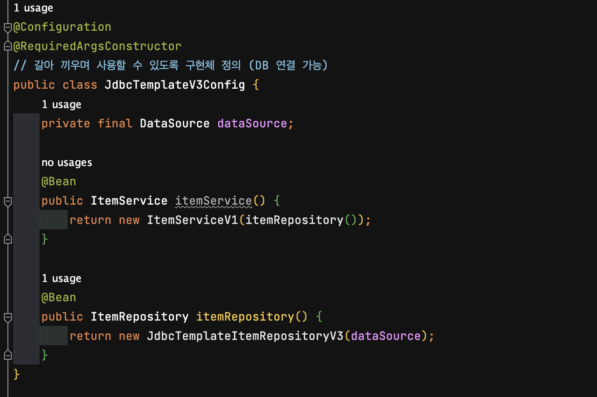

# POJO는 무엇일까?

**POJO(Plain Old Java Object)** 란 다른 클래스나 인터페이스를 상속 받아 메서드가 추가된 클래스가 아닌,  
일반적으로 우리가 알고 있는 **Getter, Setter와 같은** 기본적인 기능만 가진 자바 객체를 말한다.

즉, **특정 기술에 종속되지 않는 순수한 자바 객체**  
다른 환경에 종속되지 않고, 필요에 따라 재사용이 가능한 자바 오브젝트이다.

스프링 프레임워크의 가장 중요한 의의가 POJO로 자바 어플리케이션을 개발하는 것이므로,  
스프링의 주요 기능은 대부분 IoC 컨테이너 안에서 POJO를 구상하고 관리하는 일과 연관되어있다.

예를 들어보자.  
  
위 객체는 기본적인 Getter, Setter 기능만 가지고 있다.  
**특정 기술에 종속되지 않은 재사용 가능한** 순수 자바 객체이기 때문에 POJO라고 할 수 있다.

같은 맥락으로,  
@Configuration, @Been 을 붙인 자바 구성 클래스를 만들거나,  
@Component, @Repository, @Service, @Controller 등을 붙인 자바 컴포넌트를 구성하는 것 또한  
**'POJO 클래스를 설계한다.'** 라고 할 수 있을것이다.

IoC 컨테이너는 이렇게 어노테이션을 붙인 자바 클래스를 스캐닝하여 어플리케이션의 일부인 것 처럼 POJO 인스턴스/빈 을 구성한다.

</br>

## 그렇다면 왜 POJO로 자바 어플리케이션을 개발해야 하는걸까?

이 의문을 해결하기 위해서는 POJO의 장점을 살펴볼 필요가 있다.

```
- 특정 규약에 종속되지 않아 객체지향 설계를 할 수 있다.
- 특정 환경에 종속되지 않아 테스트하기 좋다.
- 특정 규약에 종속되지 않아 로우레벨 코드와 비즈니스 코드가 분리되어 깔끔한 코드 작성이 가능하다.
```

즉, POJO를 잘 사용하면 자바의 객체지향적인 특징을 살려 비즈니스 로직에 충실한 개발이 가능하도록 한다는 것이다.

**_스프링은 IoC/DI, AOP, PSA 라는 주요 기술을 통해 애플리케이션을 POJO로 개발할 수 있게 해준다._**

</br>

## 자바로 POJO 구성하기

그럼 이제 본격적으로 어노테이션을 활용하여 자바 POJO를 생성하는 클래스를 구현해보자.



@Configuration, @Been 어노테이션을 활용한 클래스이다.

스프링은 @Configuration이 달린 구성 클래스를 보면 일단 그 안의 Bean 인스턴스 정의부,  
즉 @Bean이 붙은, 빈 인스턴스를 생성해 반환하는 메서드를 찾는다.

구성 클래스의 메소드에 @Bean을 붙이면 빈이 생성되는데 name 속성값을 지정해 빈 이름을 지정해 줄 수 있다.  
`ex) @Bean(name="myBean")`  
name 속성값을 지정해주지 않으면 원본 메소드 이름과 같은 이름의 빈이 생성된다.

다음 단계로 어노테이션을 붙인 자바 클래스를 스캐닝하기 위해 IoC 컨테이너를 인스턴스화 해야한다.

스프링에서 제공하는 IoC 컨테이너는 기본 구현체인 **_Bean Factory_**,  
그리고 이와 호환되는 고급 구현체인 **_Application Context_** 두가지가 있다.

둘은 각각 빈 팩토리, 어플리케이션 컨텍스트에 접근하기위한 인터페이스다.  
그리고 Application Context는 Bean Factory의 하위 인터페이스라서 호환성이 보장된다.

---

Bean 설정 방법에 있어 과거에는 **_XML Config_** 방식을 사용 하였지만 최근에 와서는 **_Java Config_** 방식을 사용하고 있고,  
본문에서는 Java Config 방식을 다루고 있다. XML Config 방식은 추후에 알아보도록 하자.

---

### Reference

[[Spring] POJO란?](https://yoo11052.tistory.com/133)  
[CHAP 2.1 자바로 POJO 구성하기](https://invincibletyphoon.tistory.com/75)
[Spring 특징(1): POJO](https://velog.io/@alicesykim95/Spring-POJOPlain-Old-Java-Object)
