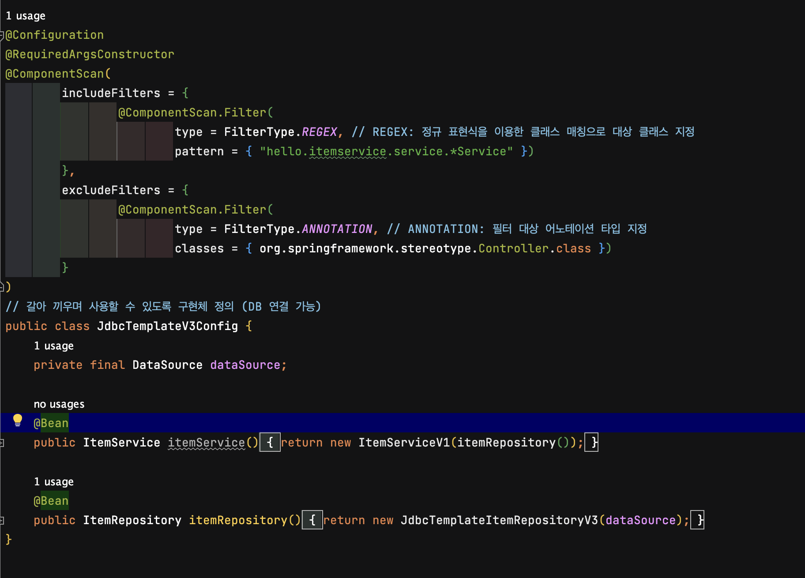
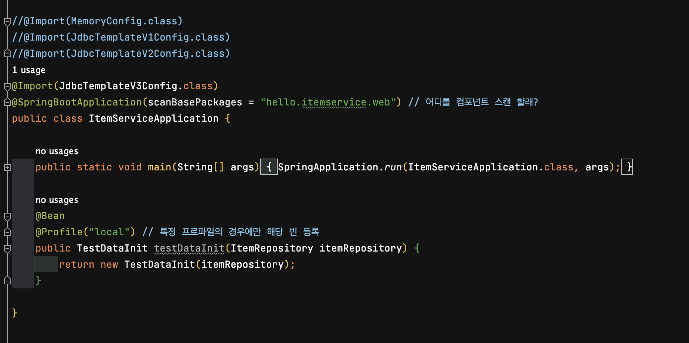
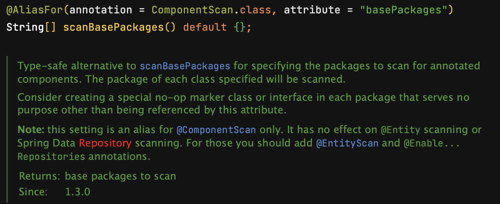

# POJO는 무엇일까?

**POJO(Plain Old Java Object)** 란 다른 클래스나 인터페이스를 상속 받아 메서드가 추가된 클래스가 아닌,  
일반적으로 우리가 알고 있는 **Getter, Setter와 같은** 기본적인 기능만 가진 자바 객체를 말한다.

즉, **특정 기술에 종속되지 않는 순수한 자바 객체**  
다른 환경에 종속되지 않고, 필요에 따라 재사용이 가능한 자바 오브젝트이다.

스프링 프레임워크의 가장 중요한 의의가 POJO로 자바 어플리케이션을 개발하는 것이므로,  
스프링의 주요 기능은 대부분 IoC 컨테이너 안에서 POJO를 구상하고 관리하는 일과 연관되어있다.

예를 들어보자.  
  
위 객체는 기본적인 Getter, Setter 기능만 가지고 있다.  
**특정 기술에 종속되지 않은 재사용 가능한** 순수 자바 객체이기 때문에 POJO라고 할 수 있다.

같은 맥락으로,  
@Configuration, @Been 을 붙인 자바 구성 클래스를 만들거나,  
@Component, @Repository, @Service, @Controller 등을 붙인 자바 컴포넌트를 구성하는 것 또한  
**'POJO 클래스를 설계한다.'** 라고 할 수 있을것이다.

```
@Component는 스프링이 발견할 수 있게 POJO에 붙이는 범용 어노테이션이다.
Persistent(영속화), Service(서비스), Presentation(표현)의 세 레이어가 있는데,
@Repository, @Service, @Controller가 각각 이 세 레이어를 가리키는 어노테이션이다.
```

POJO의 쓰임새가 명확하지 않을 땐 그냥 @Component를 붙여도 되고, 특정 용도에 맞게 쓰려면 구체적으로 명시하는 편이 좋다.  
`ex) @Repository는 발생한 예외를 DataAccessException으로 감싸 던지기 때문에 디버깅시 유리함`

IoC 컨테이너는 이렇게 어노테이션을 붙인 자바 클래스를 스캐닝하여 어플리케이션의 일부인 것 처럼 POJO 인스턴스/빈 을 구성한다.

</br>

## 그렇다면 왜 POJO로 자바 어플리케이션을 개발해야 하는걸까?

이 의문을 해결하기 위해서는 POJO의 장점을 살펴볼 필요가 있다.

```
- 특정 규약에 종속되지 않아 객체지향 설계를 할 수 있다.
- 특정 환경에 종속되지 않아 테스트하기 좋다.
- 특정 규약에 종속되지 않아 로우레벨 코드와 비즈니스 코드가 분리되어 깔끔한 코드 작성이 가능하다.
```

즉, POJO를 잘 사용하면 자바의 객체지향적인 특징을 살려 비즈니스 로직에 충실한 개발이 가능하도록 한다는 것이다.

**_스프링은 IoC/DI, AOP, PSA 라는 주요 기술을 통해 애플리케이션을 POJO로 개발할 수 있게 해준다._**

[IoC/DI, AOP, PSA 란?]()

</br>

## 자바로 POJO 구성하기

그럼 이제 본격적으로 어노테이션을 활용하여 자바 POJO를 생성하는 클래스를 구현해보자.


@Configuration, @Been 어노테이션을 활용한 클래스이다.

스프링은 @Configuration이 달린 구성 클래스를 보면 일단 그 안의 Bean 인스턴스 정의부,  
즉 @Bean이 붙은, 빈 인스턴스를 생성해 반환하는 메서드를 찾는다.

구성 클래스의 메소드에 @Bean을 붙이면 빈이 생성되는데 name 속성값을 지정해 빈 이름을 지정해 줄 수 있다.  
`ex) @Bean(name="myBean")`  
name 속성값을 지정해주지 않으면 원본 메소드 이름과 같은 이름의 빈이 생성된다.

다음 단계로 어노테이션을 붙인 자바 클래스를 스캐닝하기 위해 IoC 컨테이너를 인스턴스화 해야한다.

스프링에서 제공하는 IoC 컨테이너는 기본 구현체인 **_Bean Factory_**,  
그리고 이와 호환되는 고급 구현체인 **_Application Context_** 두가지가 있다.

둘은 각각 빈 팩토리, 어플리케이션 컨텍스트에 접근하기위한 인터페이스다.  
그리고 Application Context는 Bean Factory의 하위 인터페이스라서 호환성이 보장된다.  
`Application Context는 기본 기능에 충실하면서도 Bean Factory보다 발전된 기능을 가지고 있으니, 리소스 제약을 받는 상황이 아니라면 Application Context를 사용하는게 좋다.`

Application Context는 인터페이스로, 사용하려면 구현체 클래스가 필요하다.  
스프링에서 지원하는 Application Context의 몇가지 구현체 중 **AnnotationConfigApplicationContext**가 가장 최근 기술이고, 유연하기 때문에 사용이 권장된다.

여기서 필자는 어디서 AnnotationConfigApplicationContext 인스턴스가 생성되고 반환되는지 궁금해졌다.  
함께 알아보고 싶다면 아래 링크를 참조하자.  
[SpringApplication의 실행과정]()

## 스캐닝 커스터마이징

스프링은 기본적으로 **_@Configuration, @Bean, @Component, @Repository, @Service, @Controller가 달린 클래스를 모두 감지하는데,_**  
필터를 적용하여 스캐닝 과정을 커스터마이징 하면 원하는 어노테이션만 컨텍스트에 포함시키거나 제외할 수 있다.

모든 패키지를 스캐닝하면 시동 과정이 쓸데없이 느려 질 수 있어서 유용하다.

아래는 앞서 소개한 Config 클래스에 @ComponentScan을 사용해 필터를 적용한 예시다.  


스프링에서 지원하는 필터 표현식은 네종류다.

```
- ANNOTATION: 필터 대상 어노테이션 타입 지정
- ASSIGNABLE: 필터 대상 클래스/인터페이스 지정
- REGEX: 정규 표현식을 이용한 클래스 매칭으로 대상 클래스 지정
- AspectJ: AspectJ 포인트 컷 표현식으로 클래스를 매칭하여 대상 클래서 지정
```

위 예시에서는 REGEX, ANNOTATION 표현식을 이용해 필터를 적용시켰다.  
includeFilters 에서 **_"hello.itemservice.service.\*Service"_** 형태의 이름을 가진 클래스를 포함했기 때문에, 어노테이션이 달려있지 않아도 스프링이 자동으로 감지한다.  
excludeFilters 에서는 **_Controller 클래스_**를 지정해 제외시켰다.

<br>

추가로 아래의 예시도 살펴보자.



@SpringBootApplication어노테이션의 scanBasePackages로 컴포넌트 스캔 범위를 지정하고 있다.  
이 경우 scanBasePackages설정 시 ComponentScan이 동작하기 때문에 가능하다.



---

Bean 설정 방법에 있어 과거에는 **_XML Config_** 방식을 사용 하였지만 최근에 와서는 **_Java Config_** 방식을 사용하고 있고,  
본문에서는 Java Config 방식을 다루고 있다. XML Config 방식은 추후에 알아보도록 하자.

---

### Reference

[[Spring] POJO란?](https://yoo11052.tistory.com/133)  
[CHAP 2.1 자바로 POJO 구성하기](https://invincibletyphoon.tistory.com/75)  
[Spring 특징(1): POJO](https://velog.io/@alicesykim95/Spring-POJOPlain-Old-Java-Object)  
[[Spring] SpringBoot 소스 코드 분석하기, @SpringBootApplication 어노테이션의 속성과 구성요소 - (3)](https://mangkyu.tistory.com/211)
